# Hash Dental Care Website

* # Introduction
    Hash dental care is a full-stack framework and responsive dentist website that allows users to book, cancel, and update their appointments.

    

* ## Live Preview   
    * ### For a live preview click: [Hash Dental Care](https://hash-dental-care.herokuapp.com/)

* [UX](#ux)
    * [Entity Relationship Model](#entity-relationship-model)
    * [Agile Methodology](#agile-methodology)
    * [Flowchart](#flowchart)
    * [Color Scheme](#color-scheme)
    * [Fonts Used](#fonts-used)
    * [User Stories](#user-stories)
    * [Admin Stories](#admin-stories)
    * [Wireframes](#wireframes)

* [Features](#features)
    * [Existing Features](#existing-features)
    * [Future Features](#future-features)

* [Testing](#testing)

* [Bugs](#bugs)
    
    * [Fixed Bugs](#fixed-bugs)
    * [Unfixed Bugs](#unfixed-bugs)

* [Technologies Used](#technologies-used)

    * [Languages Used](#languages-used)
    * [Libraries/Framework Used](#librariesframework-used)
    * [Other Technologies](#other-technologies)

* [Deployments](#deployments)

    * [Heroku](#heroku)
    * [Github](#github)

* [Credits](#credits)

* # UX

    * ## Entity Relationship Model
        * Before I started this project, I created a relationship entity for a Django apps, which helped me determine that what models fields are needed for this project.

            

    * ## Agile Methodology
        * This project was created using the agile methodology and github issue boards.

            

            

    * ## Flowchart
        * A flowchart was created to illustrate how different users can access my website. for example, if users are logged in, they can access a form and make appointments, while if they are not logged in, they cannot make appointments. They will be asked to login/sign up. 

            

    * ## Color Scheme
        * Using Google, I searched what colors are best for the dentist's website and that is user-friendly too, and I decided to go for blueish and greenish tone.

            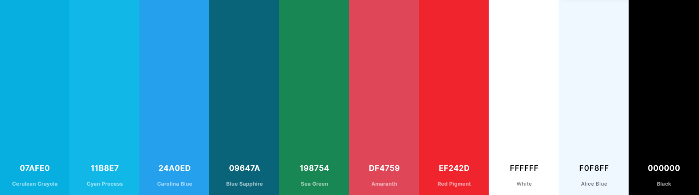

    * ## Fonts Used
        * ### To make the website stand out for a UX, multiple fonts were used:
            * 'Oswald', sans-serif

                

            * 'Source Sans Pro', sans-serif

                

            * 'Telex', sans-serif

                

            * 'Dangrek', cursive

                
                
            * 'Roboto', sans-serif

                

    * ## User Stories
        * As a site user I would like to have an option that, if I'm logged in, so there will be an option for a logout.
        * As a site user I would like to have a cancel option in my already booked appointments so I can cancel my bookings.
        * As a site user I would like to have an edit button in my already booked appointment so I can update my details.
        * As a site user I would like to see a different treatment options in a booking form so I can select one.
        * As a site user I would like to see a different sectors of treatments with titles, images, and descriptions, so I can choose the right treatment for myself.
        * As a site user I would like to have an emergency contact option so I can create an emergency appointment.
        * As a site user I would like to have a contact us option so I can contact the customer service team.
        * As a site user I would like to have a book appointment button that leads me to another page so I can fill in my details to book an appointment.
        * As a existing site user I would like to have a login form so I can see my appointments by logging in.
        * As a new site user I would like to have a registration form so I can create an account with the website.
        * As a site user I would like to have multiple buttons to adjust my appointments so by selecting next button to get to the next page or by pressing prev to get back to the previous page.

    * ## Admin Stories 
        * As a site admin I would like to add treatments option inside the booking form using treatments models.
        * As a site admin I would like to add an approval option so that I can be control of users appointment approvel request.
        * As a site admin I would like to create base html file which contains header/nav and footer for multiple pages.
        * As a site admin I would to add an option that if the user tries to book appointment without login/sign up, users will be asked to login/sign up.
        * As a site Admin I would like to redirect users to manage booking page after they submit an appointment form so they can see if their appointment is approved or not.
        * As a site Admin I would like to add an option which will not allow the user to change or update appointment details once the appointment has been approved and the appointment status has changed from pending to approved.

    * ## Wireframes
        * Project wireframe was created by using [Balsamiq Wireframes](https://balsamiq.com/wireframes/)
        * You can find a website's wireframe by clicking [wireframe](WireFrame.md)

* # Features 

    * ## **Existing Features**
    * ### **Header/Nav** 
        * There is a slight difference between the navigation bar for guest users and logged in users, and both are fully responsive. The navigation bar contains buttons that lead to other pages.
            * ### Guest User
                    
                 
                 
                 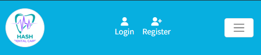
                
            * ### Logged In User
                  
                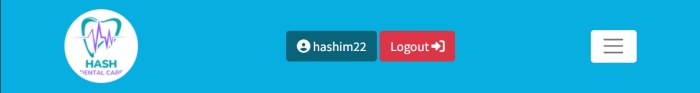
                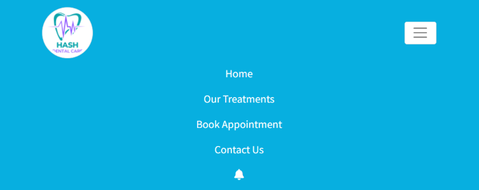
                  

    * ### **Home Page**  
        * The homepage welcomes the user and there is an option button that takes the users directly to the booking page. The user just has to click on the Book Appointment once they register or sign in as the option is available once they enter the site which is a much more straightforward option for an elder generation who might find technology confusing.  
            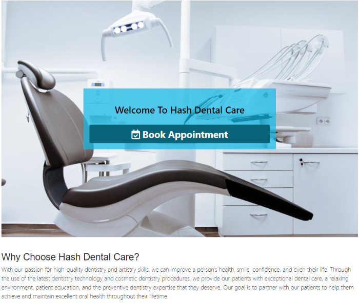  

        * The Book Appointment button on home page will require user to `login/register` before they can book an appointment.  
            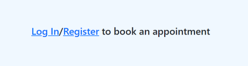

        * I have hidden the option to book an appointment for the smaller devices. Due to the size of the screen being too small and ux.  
            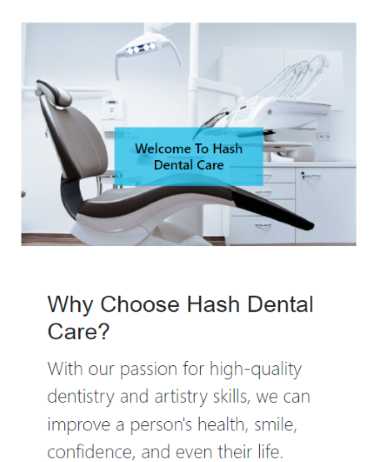  

    * ### **Treaments Page**  
        * The user can meet one of our specialists on the treatment page and choose which treatment they are interested in and for a larger devices, there is an image added next to it.  
            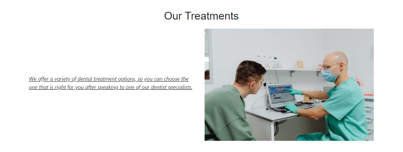

        * In order to make the site more responsive for smaller devices, I have hidden the image for mobile phones and small tablets.  
            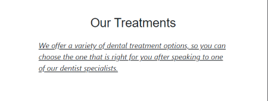

        * On each bootstrap card, there is an image, title, description, and a price, where user can see all the different treatments listed. which user can click on the price button to get to the book appointment form, and if users are not logged in, they will be asked to `login/register` first.  
            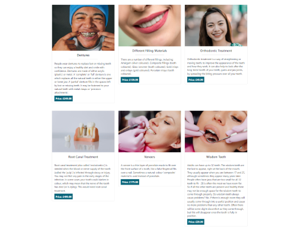
 
         
    * ### **Book Appointment Page**
        * Guest users will not have access to appointment form, they will be asked to `login/register` first.    
              

        * This form was created using the `django-bootstrap-datepicker-plus` library, which made it form look more professional.    
        * If users are logged in, they can fill out the book appointment form by inputting their details in, however if they are not logged in they will need to `login/register` first to book.    
            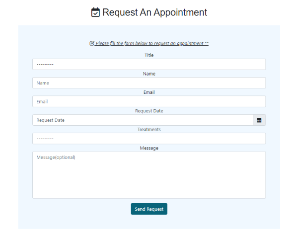 

        * The past dates cannot be used to book appointments by the user as I have disabled the option.  
            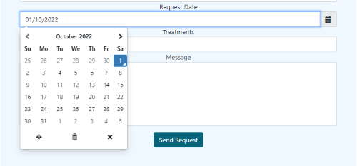 

        * Due to the fact that I imported the Treatment model as a `ForignKey` which I created separately for our treatment page, users can access this treatment drop down.  
            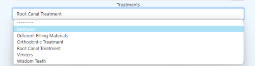 

        * After submitting, users will be redirected to my booking page, where a pop-up message will display that their request has been submitted and it will be shown for 3 seconds and it will disappear after that.  

            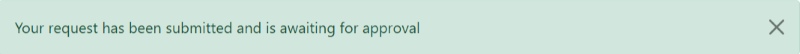

   * ### **Manage-booking Page**
        * Guest users will not have access to this page. If the user is logged in and they don't have any appointments booked, the page will display that `currently, you do not have any booked appointments` and the book appointment button will be displayed too.  
            

        * Admin-approved appointments can't be updated or deleted by users. The user will see green text and a tick icon when the admin approves the appointment.   
            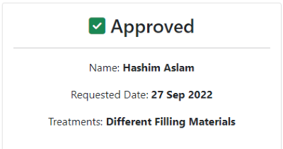  

        * When users books an appointment but their request is still pending, they will see a large orange text and a loading time icon, so they can update or delete their appointments. 
            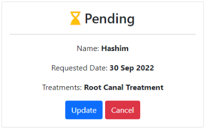

        * When a user clicks on the update button from the pending appointments, they will be taken to the update form where they can update their information.        
            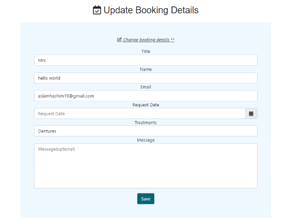

        * When the user clicks the cancel button from pending appointments, they will be asked if they are sure they want to cancel their appointment. By clicking confirm, their appointment will be cancelled, and by clicking cancel, they will be taken back to their appointment page.  

        * As a last-minute change, I changed the cancel button's background-color from `green` to `grey`. The mentor suggested that the cancel button should look normal.  
            

        * If the user's appointment exceeds 6, the next pagination button will appear. The next pagination button will take the user to the next page, and the previous pagination button will return the user to the previous page.  
            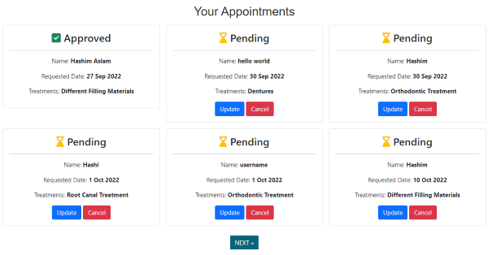
            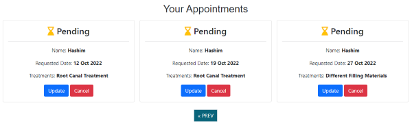

   
    * ### **Contact Us Page**
        * Guests and logged in users have access to the contact us page, so users don't need to register or login to send us a message.  
            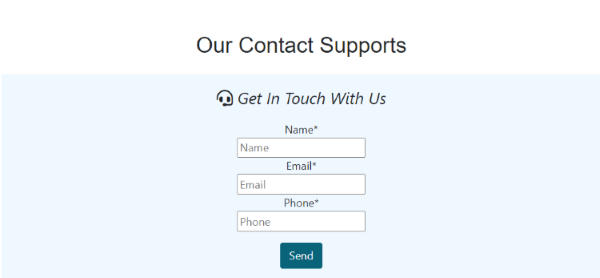

        * After submitting the contact us form successfully, the user will see a pop-up text saying `thanks for contacting us, we'll get back to you as soon as possible`, which will disappear after 3 seconds.  
            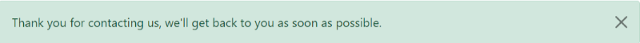

        * If a user is experiencing an emergency dental problem, they can get a free consultation at any 24 hours on a phone call from our dental health specialists who will advise them if there is a need for an emergency appointment or if they need to go to hospital and get their teeth treated.    
            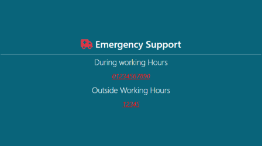  

        * Adding the map makes it easier for users to find our location.  
            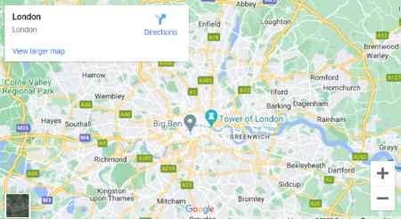  

    * ### **Logout Page**
        * `django-allauth` library was used to handel all the messages and errors for `login`, `register` and `logout` page.
        * Logged in users will not see a registration or login button. Instead, they will see a logout button in the navbar, and clicking that will prompt them to confirm that they wish to logout.  
            

        * Upon confirming sign out, the user will be logged out from the website, and a pop-up model will display the message `You have signed out`, which will disappear after 3 seconds.  
            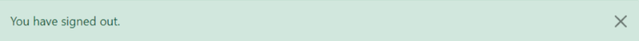

    * ### **Registration Page**
        * When users have successfully registered with the website, they will be directed to the home page and see successfully signed in.  
            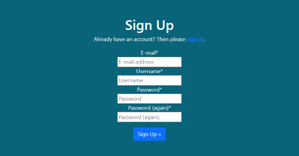
 
    * ### **Login Page**
        * If users are not logged in but they already have an account with the website, they can login from the navbar login button.
            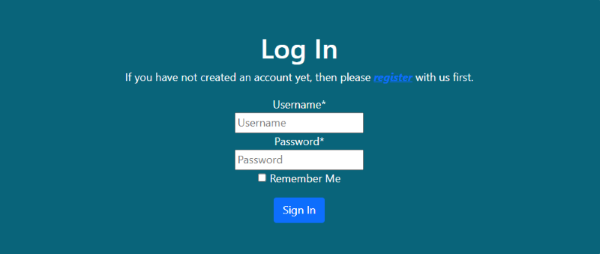

        * Upon successful login, the user are redirected to the home page and a pop-up message will show up, which says successfully logged in and the message disappears after 3 seconds.  
            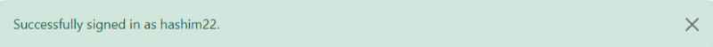

    * ### **Footer**  
        * All the users will have access to the footer section of the page, where they can find information about clinic opening hours, contact support, clinic location, and our social media platforms.
            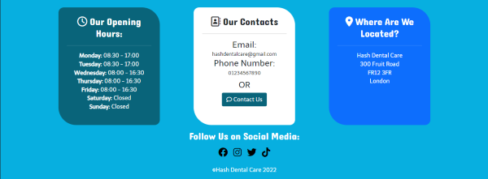

        * I have removed our location from medium and smaller devices for a better user experience.  
            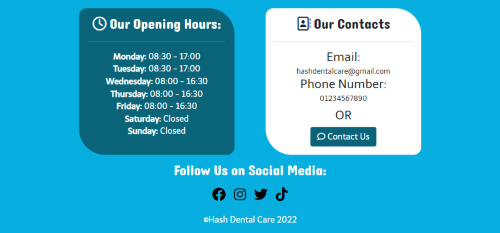  

            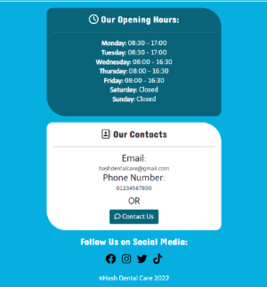
    

    * ## **Future Features**
        * A better login and registration form will be added in the future, and users will only be allowed to register if they verify their email address.  

        * To make signing up easier for new users, I would like to add an option of a one-click signup button where users who already have an account with Google or Facebook, can sign up by simply clicking on Google or facebook.  

        * In the future, I would like to prevent users from selecting the same treatment option twice. So users will not be able to choose the same treatment again in the booking form.

        * When a user has already booked an appointment, if the date has passed the current date, their appointment will automatically display as expired.

* # Testing

* You can check what testing has been performed for the website by clicking [Testing.md](testings.md)

* # Bugs

* Multiple bugs were encountered during the development stage.

    * ### Fixed Bugs
        * First issue encounterd was the `requested date` field on the `Book Appointment` form, where users entered their details in but as soon as they click on the submit button, the form wouldn't submit. This issue was caused by the UK format date I added to the form widget, because by default it was US notation, so I had remove it to fix the issue.  
            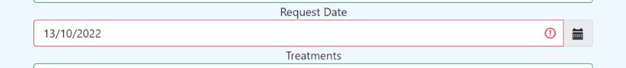  
        
        * As a result of solving the previous issue, I wanted the date to be UK formatted. It took me some time, but after searching on Google and stackoverflow, I was able to resolve the issue by going into the setting.py file, and changed this code `LANGUAGE_CODE = 'en-us'` with this `LANGUAGE_CODE = 'en-GB'`  
            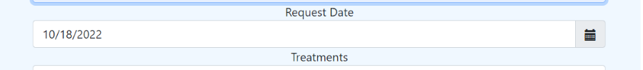
        * I also had an issue with the `contact us` page where users can enter their `name`, `email`, and `phone number`. The phone number was a problem because I added a `Charfield` model. However, the problem with that was that instead of numbers the user could input 11 digits of `ABC` letters which would still allow the form to be submitted. So to fix this issue I added `phonenumber_field` libaray which could only allow user to input only uk based phone numbers.  

        *  As I tried to manage booking text inside the navbar, the navbar got messy, so I decided to use a bell icon🔔 instead of the text. The mentor told me it wouldn't be a good idea to use the bell icon, so to fix the issue my mentor mentioned have a look at the margin of the navbar. Turns out, he was right but still couldn't add larger text, so I decided to use `My Booking` which was a small word to fit in rather than `Manage-Booking`, which was a large word. Due to the last-minute change, I wasn't able to change all this inside the readme file and django apps.  
            

    * ### Unfixed Bugs
        * The issue was scrolling down, sometimes the page scrolled down smoothly on my laptop and sometimes the scrolling down panel was visible, but scrolling down wasn't smooth at all. Upon reaching out to tutor and mentor, both of them said their computers/laptops didn't have that sort of problem, so it's probably only my laptop that has this problem.  

* # Technologies Used

    * ## Languages Used
        * [HTML](https://www.w3schools.com/html/)
        * [CSS](https://www.w3schools.com/css/)
        * [Javascript](https://en.wikipedia.org/wiki/JavaScript)
        * [Python](https://www.python.org/)

    * ## Libraries/Framework Used
        * [Django](https://www.djangoproject.com/)
        * [Bootstrap](https://getbootstrap.com/)
        * [jQuery](https://jquery.com/)

    * ### Libraries/Module Installed
        * asgiref==3.5.2
        * cloudinary==1.29.0
        * dj-database-url==1.0.0
        * dj3-cloudinary-storage==0.0.6
        * Django==3.2.15
        * django-allauth==0.51.0
        * django-bootstrap-datepicker-plus==4.0.0
        * django-bootstrap4==22.2
        * django-crispy-forms==1.14.0
        * django-phonenumber-field==7.0.0
        * gunicorn==20.1.0
        * oauthlib==3.2.1
        * phonenumbers==8.12.56
        * psycopg2==2.9.3
        * PyJWT==2.5.0
        * pylint-plugin-utils==0.7
        * python3-openid==3.2.0
        * pytz==2022.2.1
        * requests-oauthlib==1.3.1
        * sqlparse==0.4.2
        * types-cryptography==3.3.23

    * ## Other Technologies
        * [Postgres Database](https://www.postgresql.org/)
        * [W3School](https://www.w3schools.com/)
        * [Stackoverflow](https://stackoverflow.com/)
        * [Git](https://git-scm.com/)
        * [Github](https://github.com/)
        * [Gitpod workspace](https://gitpod.io/workspaces)
        * [Heroku](https://dashboard.heroku.com/apps)
        * [Flowchart](https://lucid.app/documents#/documents?folder_id=home)
        * [coolors](https://coolors.co/)
        * [Balsamiq Wireframes](https://balsamiq.com/wireframes/)
        * [jshint](https://jshint.com/)
        * [HTML code validator](https://validator.w3.org/)
        * [CSS code validator](https://jigsaw.w3.org/css-validator/)
        * [Font Awsome](https://fontawesome.com/)
        * [Google Fonts](https://fonts.google.com/)
        * [Slack](https://slack.com/intl/en-gb/)
        * [geeksforgeeks](https://www.geeksforgeeks.org/)
        * [SNYK](https://security.snyk.io/package/npm/moment)

* # Deployments
* Git and GitHub are used for version control. Python is the backend language, and can't be displayed with GitHub alone, To live preview my project, I used Heroku.

* ## Heroku
    * ### Deployment Steps On Heroku.
        * In my project i've used Django v3.2, so I used this command `pip3 install 'django<4' gunicorn` to install django.
        * So inside the terminal added these libraries:  
        `pip3 install dj_database_url psycopg2`,  
        `pip3 install dj3-cloudinary-storage`
        * Created requirements.txt file where I can save all the libraries i've installed:  
        `pip3 freeze --local > requirements.txt`
        * To create my project typed this command:  
        `django-admin startproject dentist`
        * To create my app:  
        `python3 manage.py startapp booking_app`

        * to make this app work, Into the setting.py file inside `INSTALLED_APPS` added `booking_app`
        * to migrate changes typed this command:  
        `python3 manage.py migrate`
        * to run the test if the project is working `python3 manage.py runserver`

        * When deploying for the first time on Heroku, you must first register with Heroku.
        * Create your project name and location.
        * To add Database into the app, Locate in the Resources Tab, Add-ons, search and add 'Heroku Postgres'
        * Copy DATABASE_URL value, by going into the Settings Tab, click reveal Config Vars, Copy Text
        * In your workspace Create new env.py file.
        * Import os library:  
            `import os`
        * Set environment variables:  
            `os.environ["DATABASE_URL"] = "Heroku DATABASE_URL"`
        * Add in secret key:  
            `os.environ["SECRET_KEY"] = "mysecretkey"`
        * Add Secret Key to Config Vars in Heroku settings:  
            `SECRET_KEY, "mysecretkey"`

        * Add env.py file to the settings.py file:  
            `import os`  
            `import dj_database_url`

            `if os.path.isfile("env.py"):`  
                `import env`
        * Remove the insecure secret key and replace - links to the SECRET_KEY variable on Heroku:  
            `SECRET_KEY = os.environ.get('SECRET_KEY')`

        * Comment out the old DATABASES variable in setting.py file and add this instead:  
            `DATABASES = { 'default': dj_database_url.parse(os.environ.get("DATABASE_URL"))}`

        * Save all files and Make Migrations:  
            `python3 manage.py migrate`

        * Make account with Cloudinary To get static and media files.
        * From Cloudinary Dashboard, Copy your `CLOUDINARY_URL`:  
        * Add Cloudinary URL to env.py file:  
            `os.environ["CLOUDINARY_URL"] = "cloudinary://************************"`

        * Add Cloudinary URL to Heroku Config Vars:  
            `"cloudinary://************************"`

        * Temperoily add DISABLE_COLLECTSTATIC inside the heroku config Vars:  
            `DISABLE_COLLECTSTATIC, 1`

        * Add Cloudinary Libraries to settings.py installed apps:  
            `INSTALLED_APPS = ['cloudinary_storage', 'django.contrib.staticfiles', 'cloudinary']`

        * in the settings.py file under the `STATIC_URL = 'static/'` add:  
            `STATICFILES_STORAGE = 'cloudinary_storage.storage.StaticHashedCloudinaryStorage'`  
            `STATICFILES_DIRS = [os.path.join(BASE_DIR, 'static')]`  
            `STATIC_ROOT = os.path.join(BASE_DIR, 'staticfiles')`  

            `MEDIA_URL = '/media/'`  
            `DEFAULT_FILE_STORAGE = 'cloudinary_storage.storage.MediaCloudinaryStorage'`  

        * Place under the BASE_DIR line in settings.py:  
            `TEMPLATES_DIR = os.path.join(BASE_DIR, 'templates')`

        * Change the templates directory to TEMPLATES_DIR Place within the TEMPLATES array:  
            `TEMPLATES = [{'DIRS': [TEMPLATES_DIR],],},},]`

        * Add Heroku Hostname to ALLOWED_HOSTS:  
            `ALLOWED_HOSTS = ["hash-dental-care.herokuapp.com", "localhost"]`

        * Create 3 new folders on top level directory:  
            media, static, templates

        * Create Procfile on the top level directory and inside the file add this:  
            `web: gunicorn dentist.wsgi`
        
        * before deploying on heroku make sure: 
            `DEBUG = False`
            Remove `DISABLE_COLLECTSTATIC` from the config vars.

* ## Github
    * ### Commit On Github:
        * To make my project I used gitpod worskspace, where first save all the files.
        * Then in the terminal type `git add .` to add all the changes inside the staging area.
        * The next step was `git commit -m "changes I made"` where I confirmed that what changes I want to make.
        * Last but not least, I have typed `git push` to save everything on Github.

    * ### Cloning A Repository:
        * On GitHub.com, navigate to the main page of the repository.
        * Above the list of files, click download icon which says `Code`.

            

        * To clone the repository using HTTPS, under "HTTPS", click.
        * To clone the repository using an SSH key, including a certificate issued by your organization's SSH certificate authority, click SSH, then click.
        * To clone a repository using GitHub CLI, click GitHub CLI, then click.

            

        * Open Git Bash.
        * Change the current working directory to the location where you want the cloned directory.
        * Type git clone, and then paste the URL you copied earlier.

            `$ git clone https://github.com/hashim222/hash-dental-care`

        * Press Enter to create your local clone.

* # Credits
    * ## Content
        * `Treatment page` title and description was taken from [dentalhealth.org](https://www.dentalhealth.org/) website.  
        * How to add images, title, description, and price on the Treatment page were done using the Django admin panel with help from the Code Institute's [Django blog walkthrough](https://github.com/Code-Institute-Solutions/Django3blog/tree/master/12_final_deployment) project.
        * Display a message to a user using bootstrap, this was taken from the Code Institute's [Django blog walkthrough](https://github.com/Code-Institute-Solutions/Django3blog/tree/master/12_final_deployment) project.
        * I have taken a little design inspiration from this Django [youtube doctor website tutorial](https://www.youtube.com/watch?v=3_3q_dE4_qs) in preparation for this project.
        * By making this project I had plenty of help from the [Slack](https://slack.com/intl/en-gb/) Community and tutor support.
        * In order to find a solution to a problem, I often search [Stackoverflow](https://stackoverflow.com/) and [geeksforgeeks](https://www.geeksforgeeks.org/).
        * In order to give me an idea of how a readme file should look, I looked at some other students project readme files [ladybike](https://github.com/van-essa/ladybike#table-of-contents) and [holy-shiitake](https://github.com/shellieD/holy-shiitake/). 

    * ## Media
        * Site logo was created using [canva](https://www.canva.com/) website.
        * Site Images were taken from [pexels](https://www.pexels.com/) website.

