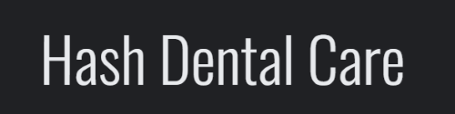
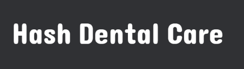
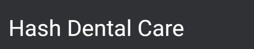

# Hash Dental Care Website

* # Introduction
    Hash dental care is a full-stack framework dentist website that allows users to book, cancel, and update their appointments.

    

    ## For a live preview click: [Hash Dental Care](https://hash-dental-care.herokuapp.com/)

* [UX](#ux)
    * [Entity Relationship Model](#entity-relationship-model)
    * [Agile Methodology](#agile-methodology)
    * [Flowchart](#flowchart)
    * [Color Scheme](#color-scheme)
    * [Fonts Used](#fonts-used)
    * [User Stories](#user-stories)
    * [Admin Stories](#admin-stories)
    * [Wireframes](#wireframes)

* [Features](#features)
    * [Existing Features](#existing-features)
    * [Future Features](#future-features)

* [Validator Testing](#validator-testing)

* [Bugs](#bugs)

    * [Fixed Bugs](#fixed-bugs)
    * [Unfixed Bugs](#unfixed-bugs)

* [Technologies Used](#technologies-used)

    * [Languages Used](#languages-used)
    * [Libraries/Framework Used](#librariesframework-used)
    * [Other Technologies](#other-technologies)

* [Deployments](#deployments)

    * [Heroku](#heroku)
    * [Github](#github)

* [Credits](#credits)

* [Acknowledgment](#acknowledgment)

* # UX

    * ## Entity Relationship Model
        * before i started this project, I created a relationship entity for a Django apps, which helped me determine that what models fields are needed for this project.

            

    * ## Agile Methodology
        * This project was created using the agile methodology and github issue boards.

            

            

    * ## Flowchart
        * A flowchart was created to illustrate how different users can access my website. for example, if users are logged in, they can access a form and make appointments, while if they are not logged in, they cannot make appointments. They will be asked to login/sign up. 

            

    * ## Color Scheme
        * Using Google, I searched what colors are best for the dentist's website and that is user-friendly too, and I decided to go for blueish and greenish tones.

            

    * ## Fonts Used
        * ### To make the website stand out for a users experience, multiple fonts were used:
            * 'Oswald', sans-serif

                

            * 'Source Sans Pro', sans-serif

                

            * 'Telex', sans-serif

                

            * 'Dangrek', cursive

                
                
            * 'Roboto', sans-serif

                

    * ## User Stories
        * As a site user I would like to have an option that, if I'm logged in, there will be an option of a logout button.
        * As a site user I would like to have cancel options in my already booked appointments so I can cancel my bookings.
        * As a site user I would like to have an edit option in my already booked appointment so i can update my details.
        * As a site user I would like to see different treatment options in the book appointment form so i can select one.
        * As a site user I would like to see different sectors of treatments with titles, images, and descriptions, so i can choose the right treatment.
        * As a site user I would like to have an emergency contact option so i can create an emergency appointment.
        * As a site user I would like to have a contact us option so i can contact the customer service team.
        * As a site user I would like to have a book appointment button that leads me to another page so i can fill in my details to book an appointment.
        * As a existing site user I would like to have a login form so i can see my appointments by logging in.
        * As a site user I would like to have a registration form so i can create an account with the app.
        * As a site user I would like to have multiple buttons to adjust my appointments so i can by select next to get to next page or by pressing prev to get back to the previous page.

    * ## Admin Stories 
        * As a site admin I would like to add treatments options inside the book appointments form using treatments models.
        * As a site admin I would like to add an approval option so that I can be control of users appointment approvel request.
        * As a site admin I would like to create base html file which contains header/nav and footer for multiple pages.
        * As a site admin I would to add an option that if the user tries to book an appointment without login/sign up, users will be asked to login/sign up.
        * As a site Admin I would like to redirect users to manage booking page after they submit an appointment form so they can see if their appointment is approved or not.

    * ## Wireframes
        * Project wireframe was created by using [Balsamiq Wireframes](https://balsamiq.com/wireframes/)
        * You can find a website's wireframe by clicking [wireframe](WireFrame.md)

* # Features 

    * ### Existing Features

    * ### Future Features

* # Validator Testing

* # Bugs

    * ### Fixed Bugs

    * ### Unfixed Bugs

* # Technologies Used

    * ## Languages Used
        * [HTML](https://www.w3schools.com/html/)
        * [CSS](https://www.w3schools.com/css/)
        * [Javascript](https://en.wikipedia.org/wiki/JavaScript)
        * [Python](https://www.python.org/)

    * ## Libraries/Framework Used
        * [Django](https://www.djangoproject.com/)
        * [Bootstrap](https://getbootstrap.com/)
        * [jQuery](https://jquery.com/)

    * ## Other Technologies
        * [W3School](https://www.w3schools.com/)
        * [Stackoverflow](https://stackoverflow.com/)
        * [Git](https://git-scm.com/)
        * [Github](https://github.com/)
        * [Gitpod workspace](https://gitpod.io/workspaces)
        * [Heroku](https://dashboard.heroku.com/apps)
        * [Flowchart](https://lucid.app/documents#/documents?folder_id=home)
        * [coolors](https://coolors.co/)
        * [Balsamiq Wireframes](https://balsamiq.com/wireframes/)
        * [Postgres Database](https://www.postgresql.org/)

* # Deployments
* Git and GitHub are used for version control. Python is the backend language, and can't be displayed with GitHub alone, To live preview my project, I used Heroku.

* ## Heroku
    * Deployment steps on Heroku. 

* ## Github
    * ### Cloning A Repository:
        * On GitHub.com, navigate to the main page of the repository.
        * Above the list of files, click download icon which says `Code`.

            

    * ### Copy the URL for the repository.
        * To clone the repository using HTTPS, under "HTTPS", click.
        * To clone the repository using an SSH key, including a certificate issued by your organization's SSH certificate authority, click SSH, then click.
        * To clone a repository using GitHub CLI, click GitHub CLI, then click.

            

        * Open Git Bash.
        * Change the current working directory to the location where you want the cloned directory.
        * Type git clone, and then paste the URL you copied earlier.

            `$ git clone https://github.com/hashim222/hash-dental-care`

        * Press Enter to create your local clone.

* # Credits

* # Acknowledgment

