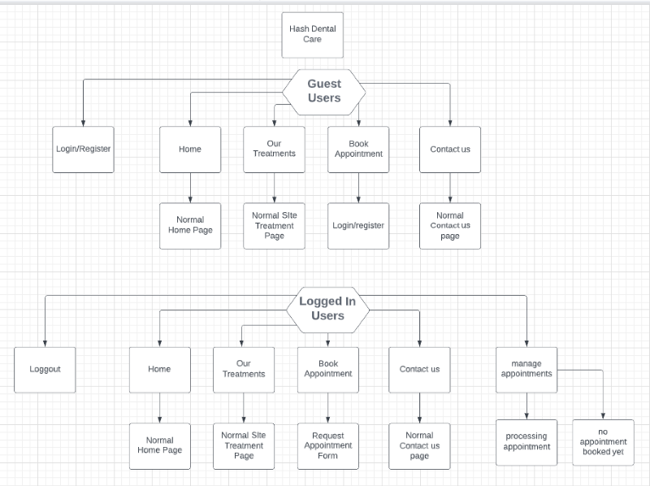

# Hash Dental Care Website

* # Introduction
    Hash dental care is a full-stack framework dentist website that allows users to book, cancel, and update their appointments.

    

* ## Live Preview   
    * ### For a live preview click: [Hash Dental Care](https://hash-dental-care.herokuapp.com/)

* [UX](#ux)
    * [Entity Relationship Model](#entity-relationship-model)
    * [Agile Methodology](#agile-methodology)
    * [Flowchart](#flowchart)
    * [Color Scheme](#color-scheme)
    * [Fonts Used](#fonts-used)
    * [User Stories](#user-stories)
    * [Admin Stories](#admin-stories)
    * [Wireframes](#wireframes)

* [Features](#features)
    * [Existing Features](#existing-features)
    * [Future Features](#future-features)

* [Testings](#testings)

* [Bugs](#bugs)
    
    * [Fixed Bugs](#fixed-bugs)
    * [Unfixed Bugs](#unfixed-bugs)

* [Technologies Used](#technologies-used)

    * [Languages Used](#languages-used)
    * [Libraries/Framework Used](#librariesframework-used)
    * [Other Technologies](#other-technologies)

* [Deployments](#deployments)

    * [Heroku](#heroku)
    * [Github](#github)

* [Credits](#credits)

* [Acknowledgment](#acknowledgment)

* # UX

    * ## Entity Relationship Model
        * before i started this project, I created a relationship entity for a Django apps, which helped me determine that what models fields are needed for this project.

            

    * ## Agile Methodology
        * This project was created using the agile methodology and github issue boards.

            

            

    * ## Flowchart
        * A flowchart was created to illustrate how different users can access my website. for example, if users are logged in, they can access a form and make appointments, while if they are not logged in, they cannot make appointments. They will be asked to login/sign up. 

            

    * ## Color Scheme
        * Using Google, I searched what colors are best for the dentist's website and that is user-friendly too, and I decided to go for blueish and greenish tone.

            

    * ## Fonts Used
        * ### To make the website stand out for a UX, multiple fonts were used:
            * 'Oswald', sans-serif

                

            * 'Source Sans Pro', sans-serif

                

            * 'Telex', sans-serif

                

            * 'Dangrek', cursive

                
                
            * 'Roboto', sans-serif

                

    * ## User Stories
        * As a site user I would like to have an option that, if I'm logged in, there will be an option of a logout.
        * As a site user I would like to have a cancel option in my already booked appointments so I can cancel my bookings.
        * As a site user I would like to have an edit button in my already booked appointment so i can update my details.
        * As a site user I would like to see a different treatment options in a booking form so i can select one.
        * As a site user I would like to see a different sectors of treatments with titles, images, and descriptions, so i can choose the right treatment for myself.
        * As a site user I would like to have an emergency contact option so i can create an emergency appointment.
        * As a site user I would like to have a contact us option so i can contact the customer service team.
        * As a site user I would like to have a book appointment button that leads me to another page so i can fill in my details to book an appointment.
        * As a existing site user I would like to have a login form so i can see my appointments by logging in.
        * As a new site user I would like to have a registration form so i can create an account with the website.
        * As a site user I would like to have multiple buttons to adjust my appointments so by selecting next button to get to the next page or by pressing prev to get back to the previous page.

    * ## Admin Stories 
        * As a site admin I would like to add treatments option inside the booking form using treatments models.
        * As a site admin I would like to add an approval option so that I can be control of users appointment approvel request.
        * As a site admin I would like to create base html file which contains header/nav and footer for multiple pages.
        * As a site admin I would to add an option that if the user tries to book appointment without login/sign up, users will be asked to login/sign up.
        * As a site Admin I would like to redirect users to manage booking page after they submit an appointment form so they can see if their appointment is approved or not.
        * As a site Admin I would like to add an option if user's are approved by admin they wont be able to update or cancel appointments.

    * ## Wireframes
        * Project wireframe was created by using [Balsamiq Wireframes](https://balsamiq.com/wireframes/)
        * You can find a website's wireframe by clicking [wireframe](WireFrame.md)

* # Features 

    * ### Existing Features

    * ### Future Features

* # Testings

* You can check what testing has been performed for the website by clicking [Testing.md](testings.md)

* # Bugs

* Multiple bugs were encountered during the development stage.

    * ### Fixed Bugs
        * First issue encounterd was the `requested date` field on the `Book Appointment` form, where users entered their details in but as soon as they click on the submit button, the form wouldn't submit. This issue was caused by the UK format date I added to the form widget, because by default it was US notation, so I had remove it to fix the issue.
        * As a result of solving the previous issue, I wanted the date to be UK formatted. It took me some time, but after searching on Google and stackoverflow, I was able to resolve the issue by going into the setting.py file, and changed this code `LANGUAGE_CODE = 'en-us'` with this `LANGUAGE_CODE = 'en-GB'`
        * I also had an issue with the `contact us` page where users can enter their `name`, `email`, and `phone number`. The phone number was a problem because I added a `Charfield` model. However, the problem with that was that instead of numbers the user could input 11 digits of `ABC` letters which would still allow the form to be submitted. So to fix this issue i added `phonenumber_field` libaray which could only allow user to input only uk based phone numbers.

    * ### Unfixed Bugs
        * The issue was scrolling down, sometimes the page scrolled down smoothly on my laptop, but sometimes the scrolling down panel was visible, but scrolling down wasn't smooth at all. Upon reaching out to tutor and mentor, both of them said their computers/laptops didn't have that sort of problem, so it's probably only my laptop that has this problem.

* # Technologies Used

    * ## Languages Used
        * [HTML](https://www.w3schools.com/html/)
        * [CSS](https://www.w3schools.com/css/)
        * [Javascript](https://en.wikipedia.org/wiki/JavaScript)
        * [Python](https://www.python.org/)

    * ## Libraries/Framework Used
        * [Django](https://www.djangoproject.com/)
        * [Bootstrap](https://getbootstrap.com/)
        * [jQuery](https://jquery.com/)

    * ### Libraries/Module Installed
        * asgiref==3.5.2
        * cloudinary==1.29.0
        * dj-database-url==1.0.0
        * dj3-cloudinary-storage==0.0.6
        * Django==3.2.15
        * django-allauth==0.51.0
        * django-bootstrap-datepicker-plus==4.0.0
        * django-bootstrap4==22.2
        * django-crispy-forms==1.14.0
        * django-phonenumber-field==7.0.0
        * gunicorn==20.1.0
        * oauthlib==3.2.1
        * phonenumbers==8.12.56
        * psycopg2==2.9.3
        * PyJWT==2.5.0
        * pylint-plugin-utils==0.7
        * python3-openid==3.2.0
        * pytz==2022.2.1
        * requests-oauthlib==1.3.1
        * sqlparse==0.4.2
        * types-cryptography==3.3.23

    * ## Other Technologies
        * [W3School](https://www.w3schools.com/)
        * [Stackoverflow](https://stackoverflow.com/)
        * [Git](https://git-scm.com/)
        * [Github](https://github.com/)
        * [Gitpod workspace](https://gitpod.io/workspaces)
        * [Heroku](https://dashboard.heroku.com/apps)
        * [Flowchart](https://lucid.app/documents#/documents?folder_id=home)
        * [coolors](https://coolors.co/)
        * [Balsamiq Wireframes](https://balsamiq.com/wireframes/)
        * [Postgres Database](https://www.postgresql.org/)
        * [jshint](https://jshint.com/)
        * [HTML code validator](https://validator.w3.org/)
        * [CSS code validator](https://jigsaw.w3.org/css-validator/)

* # Deployments
* Git and GitHub are used for version control. Python is the backend language, and can't be displayed with GitHub alone, To live preview my project, I used Heroku.

* ## Heroku
    * ### Deployment Steps On Heroku.
        * In my project i've used Django v3.2, so i used this command `pip3 install 'django<4' gunicorn` to install django.
        * So inside the terminal added these libraries:  
        `pip3 install dj_database_url psycopg2`,  
        `pip3 install dj3-cloudinary-storage`
        * Created requirements.txt file where i can save all the libraries i've installed:  
        `pip3 freeze --local > requirements.txt`
        * To create my project typed this command:  
        `django-admin startproject dentist`
        * To create my app:  
        `python3 manage.py startapp booking_app`

        * to make this app work, Into the setting.py file inside `INSTALLED_APPS` added `booking_app`
        * to migrate changes typed this command:  
        `python3 manage.py migrate`
        * to run the test if the project is working `python3 manage.py runserver`

        * When deploying for the first time on Heroku, you must first register with Heroku.
        * Create your project name and location.
        * To add Database into the app, Locate in the Resources Tab, Add-ons, search and add 'Heroku Postgres'
        * Copy DATABASE_URL value, by going into the Settings Tab, click reveal Config Vars, Copy Text
        * In your workspace Create new env.py file.
        * Import os library:  
            `import os`
        * Set environment variables:  
            `os.environ["DATABASE_URL"] = "Heroku DATABASE_URL"`
        * Add in secret key:  
            `os.environ["SECRET_KEY"] = "mysecretkey"`
        * Add Secret Key to Config Vars in Heroku settings:  
            `SECRET_KEY, "mysecretkey"`

        * Add env.py file to the settings.py file:  
            `import os`  
            `import dj_database_url`

            `if os.path.isfile("env.py"):`  
                `import env`
        * Remove the insecure secret key and replace - links to the SECRET_KEY variable on Heroku:  
            `SECRET_KEY = os.environ.get('SECRET_KEY')`

        * Comment out the old DATABASES variable in setting.py file and add this instead:  
            `DATABASES = { 'default': dj_database_url.parse(os.environ.get("DATABASE_URL"))}`

        * Save all files and Make Migrations:  
            `python3 manage.py migrate`

        * Make account with Cloudinary To get static and media files.
        * From Cloudinary Dashboard, Copy your `CLOUDINARY_URL`:  
        * Add Cloudinary URL to env.py file:  
            `os.environ["CLOUDINARY_URL"] = "cloudinary://************************"`

        * Add Cloudinary URL to Heroku Config Vars:  
            `"cloudinary://************************"`

        * Temperoily add DISABLE_COLLECTSTATIC inside the heroku config Vars:  
            `DISABLE_COLLECTSTATIC, 1`

        * Add Cloudinary Libraries to settings.py installed apps:  
            `INSTALLED_APPS = ['cloudinary_storage', 'django.contrib.staticfiles', 'cloudinary']`

        * in the settings.py file under the `STATIC_URL = '/static/'` add:  
            `STATICFILES_STORAGE = 'cloudinary_storage.storage.StaticHashedCloudinaryStorage'`  
            `STATICFILES_DIRS = [os.path.join(BASE_DIR, 'static')]`  
            `STATIC_ROOT = os.path.join(BASE_DIR, 'staticfiles')`  

            `MEDIA_URL = '/media/'`  
            `DEFAULT_FILE_STORAGE = 'cloudinary_storage.storage.MediaCloudinaryStorage'`  

        * Place under the BASE_DIR line in settings.py:  
            `TEMPLATES_DIR = os.path.join(BASE_DIR, 'templates')`

        * Change the templates directory to TEMPLATES_DIR Place within the TEMPLATES array:  
            `TEMPLATES = [{'DIRS': [TEMPLATES_DIR],],},},]`

        * Add Heroku Hostname to ALLOWED_HOSTS:  
            `ALLOWED_HOSTS = ["hash-dental-care.herokuapp.com", "localhost"]`

        * Create 3 new folders on top level directory:  
            media, static, templates

        * Create Procfile on the top level directory and inside the file add this:  
            `web: gunicorn dentist.wsgi`
        
        * before deploying on heroku make sure: 
            `DEBUG = False`
            Remove DISABLE_COLLECTSTATIC from the config vars.

* ## Github
    * ### Deploying On Github:
        * To make my project i used gitpod worskspace, where first save all the files.
        * Then in the terminal type `git add .` to add all the changes inside the staging area.
        * The next step was `git commit -m "changes I made"` where I confirmed that what changes I want to make.
        * Last but not least, I have typed `git push` to save everything on Github.

    * ### Cloning A Repository:
        * On GitHub.com, navigate to the main page of the repository.
        * Above the list of files, click download icon which says `Code`.

            

    * ### Copy the URL for the repository.
        * To clone the repository using HTTPS, under "HTTPS", click.
        * To clone the repository using an SSH key, including a certificate issued by your organization's SSH certificate authority, click SSH, then click.
        * To clone a repository using GitHub CLI, click GitHub CLI, then click.

            

        * Open Git Bash.
        * Change the current working directory to the location where you want the cloned directory.
        * Type git clone, and then paste the URL you copied earlier.

            `$ git clone https://github.com/hashim222/hash-dental-care`

        * Press Enter to create your local clone.

* # Credits

* # Acknowledgment

