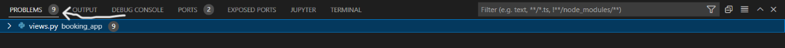

## Testings

* ## This project was tested manually several times throughout develepment.

    Access✅
    No Access❌ 
    * ## Guest user's testings 
    * ### All these functionalities have been tested for a guest users, and they work fine.
        * User's have access to Home Page✅
        * In the Home page user's can click the `Book Appointment` button to make an appointment❌
        * User's have access to Treatments page✅
        * To make an appointment, users can click the treatment they are interested in on the Treatments page❌
        * User's have access to Contact Us page✅
        * Users's have access to Manage Booking Page❌
        * By filling out the form, users can contact us✅
        * User's have access to login/register page✅
        * User's Have access to logout page❌

    * ## Logged In user's testings 
    * ### All these functionalities have been tested for a Logged In users, and they work fine.
        * User's have access to Home Page✅
        * In the Home page user's can click the `Book Appointment` button to make an appointment✅
        * User's have access to Treatments page✅
        * To make an appointment, users can click the treatment they are interested in on the Treatments page✅
        * User's have access to Contact Us page✅
        * Users's have access to Manage Booking Page✅
        * Despite not having booked an appointment yet, users can see their appointments on the manage booking page❌
        * manage booking page allows users to update and delete their appointments even if they have not yet booked any appointments yet❌
        * By filling out the form, users can contact us✅
        * User's have access to login/register page❌
        * User's Have access to logout page✅    

    * ### Due to a problem with the PEP8 Python code validator, I have to rely on Pylint which was installed in my project. So there is a problems section in the terminal that will display any errors that needs to be fixing, so it was very easy to use.
        

    * Even after fixing many of the small pylint errors and warnings, some related to built-in Django code that I couldn't fix.  
        * booking_app app
            

        * contact app
            

        * treatments app
            

* ### Html Code Validator
